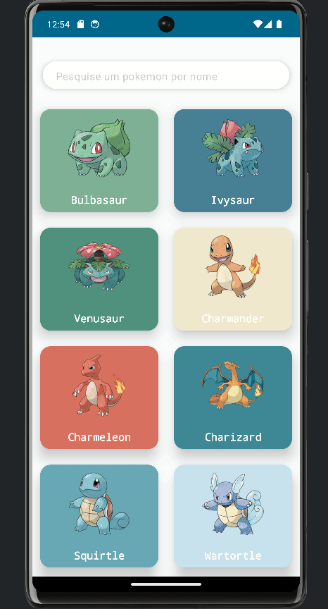
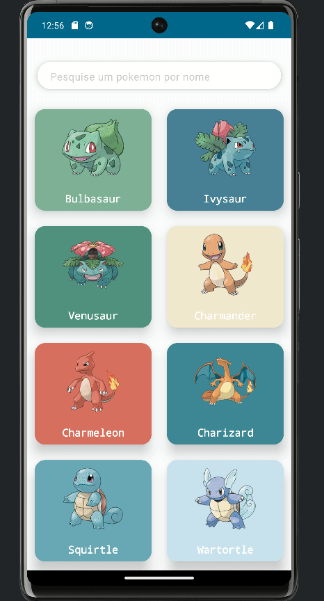

# Pokedex app

Esse projeto é destinado a exibição de informações sobre pokemon com testes de arquitetura de aplicativo mobile quanto de práticas técnicas.

# O que ele contempla?

- Projeto multimodular
- Projeto com feature utilizando jetpack compose (feat-pokedex)
- Projeto com Clean Arc + MVVM + Repository Pattern (feat-pokedex).
- Exemplo de testes unitários em todas as camadas do Clean (feat-pokedex).
- Exemplo de testes instrumentados com jetpack compose (feat-pokedex).
- Exemplo de tratativas de acessibilidade com jetpack compose (feat-pokedex).

# Todo list
 - Projeto com feature layout em XML
 - Projeto com feature em flutter
 - Melhorias na arquitetura do projeto

# Sobre a arquitetura 1.0

A arquitetura possui alguns módulos-chave e regras fundamentais que devem ser seguidas para alcançar com sucesso o seu objetivo. O Módulo APP é responsável por iniciar a aplicação e deve ter acesso a todas as funcionalidades, pois atua como a ponte entre as diferentes features quando necessário.

Os Módulos de Features constituem a camada central da aplicação e foram projetados para permitir que cada feature siga o padrão desenvolvido pela squad. É importante ressaltar que as features não devem se referenciar umas às outras diretamente; em vez disso, toda comunicação interna deve ser realizada através do Módulo APP. Além disso, as features têm a flexibilidade de utilizar a camada de Libraries para compartilhar esforços comuns entre times. Dessa forma, a arquitetura busca promover a modularidade, a reutilização de código e uma melhor colaboração entre as equipes.

Os Módulos de Libraries englobam tudo o que é de abrangência Cross squad/time, indo além de uma feature específica e aplicando-se ao escopo do projeto como um todo. Um exemplo disso é a criação da camada "commons". É importante destacar que as Libraries NÃO podem ter dependências com os Módulos de Features, pois isso poderia criar uma dependência indireta entre os módulos, o que deve ser evitado para manter a independência e a coesão dos componentes da arquitetura. Dessa forma, ao evitar tais dependências, busca-se promover uma arquitetura mais modular, reutilizável e bem-organizada.

Segue a imagem exemplificando

# Sobre a feat-pokedex

O objetivo funcional é listar todos os Pokémons em uma lista infinita e, ao tocar em algum deles, exibir a tela de detalhes do Pokémon correspondente.

  

Tem como objetivo técnico, ser um dos módulos (features) exemplo do projeto, ele foi desenvolvido usando Clean Architecture em conjunto com arquitetura MVVM para fazer as tratativas de apresentação e Repository Pattern para as tratativas de acesso aos dados.

A base para escolha das arquiteturas escolhidas foi com base em sua flexibilidade, o que significa que esse módulo pode se adaptar facilmente a mudanças, como alterações no contrato da API, mudanças completas nas telas ou alterações no comportamento de armazenamento de dados. Além disso, outro aspecto importante é que essa estrutura pode ser facilmente testada em suas principais camadas de forma unitária.

O projeto utiliza as seguintes tecnologias para operar de forma assíncrona: Flow + Result e StateFlow para realizar as requisições. Além disso, emprega o Navigation Compose para gerenciar a navegação entre as telas, o Retrofit para realizar as requisições à API remota e o Koin como injetor de dependências. Para o carregamento de imagens remotas, o Coil Image é utilizado. Para o gerenciamento das versões e dependências unificadas, o buildSrc é empregado.
